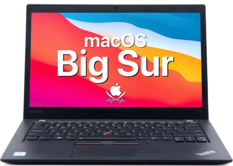

# Hackintosh — Lenovo ThinkPad T470s

  

  
  
  
  
  

---

OpenCore EFI configuration for running macOS on the Lenovo ThinkPad T470s (model 20HF/20HG).

## Hardware Specs

| Component | Details |
|-----------|---------|
| **CPU** | Intel Core i5-7300U / i7-7600U (Kaby Lake) |
| **GPU** | Intel HD Graphics 620 |
| **RAM** | 8 GB / 16 GB / 24 GB DDR4 2133 MHz |
| **Storage** | M.2 2280 NVMe / SATA SSD |
| **Display** | 14" FHD (1920x1080) IPS |
| **Audio** | Realtek ALC3245 (ALC298) |
| **Ethernet** | Intel I219-V |
| **Wi-Fi** | Intel AC 8265 (replace recommended) or Broadcom BCM94360NG |
| **Bluetooth** | Intel / Broadcom (matches Wi-Fi card) |
| **BIOS** | 1.42+ |

## Compatibility

| Feature | Status |
|---------|--------|
| **macOS Monterey (12.x)** | Supported |
| **macOS Ventura (13.x)** | Supported |
| **Display & Brightness** | Working |
| **Audio (speakers + headphone jack)** | Working |
| **USB ports (2.0 / 3.0)** | Working |
| **Ethernet** | Working |
| **Battery & power management** | Working |
| **Keyboard & TrackPoint** | Working |
| **Trackpad (with gestures)** | Working |
| **Sleep / Wake** | Working |
| **iServices (iMessage, FaceTime)** | Requires valid SMBIOS |
| **Thunderbolt 3 hotplug** | Not working |
| **Fingerprint reader** | Not working |
| **WWAN (LTE module)** | Not working |
| **SD card reader** | Not working |

## Installation

### Prerequisites

- A USB drive (16 GB+)
- A macOS installer image (Monterey or Ventura)
- [ProperTree](https://github.com/corpnewt/ProperTree) for plist editing
- [MountEFI](https://github.com/corpnewt/MountEFI) for EFI partition mounting

### Steps

1. Create a bootable macOS USB installer using [Dortania's guide](https://dortania.github.io/OpenCore-Install-Guide/installer-guide/).
2. Download the latest EFI release from this repository's [Releases page](https://github.com/Asteerix/Hackintosh-Lenovo-Thinkpad-T470s/releases).
3. Mount the EFI partition of your USB drive and copy the `EFI` folder to it.
4. **Generate your own SMBIOS** using [GenSMBIOS](https://github.com/corpnewt/GenSMBIOS) (model: `MacBookPro14,1`). Do NOT use the included serial numbers.
5. Configure BIOS settings as recommended by [Dortania](https://dortania.github.io/OpenCore-Install-Guide/config-laptop.plist/kaby-lake.html#intel-bios-settings).
6. Boot from USB and install macOS.
7. After installation, copy the EFI folder to your internal drive's EFI partition.

## Resources

- [OpenCore Documentation](https://dortania.github.io/OpenCore-Install-Guide/)
- [OpenCore GitHub](https://github.com/acidanthera/OpenCorePkg)
- [Dortania Guides](https://dortania.github.io)

## Disclaimer

This repository is provided for educational purposes only. Hackintoshing may void your warranty and carries the risk of damaging your hardware. Use at your own risk. All trademarks belong to their respective owners (Apple, Lenovo, Intel, etc.).

## License

See [LICENSE](./LICENSE) for details.
